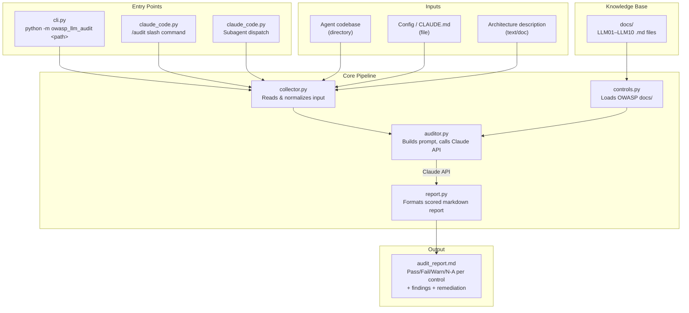

# OWASP LLM Audit Agent

An AI-powered audit tool that checks other AI agents against the [OWASP Top 10 for LLM Applications (2025)](https://genai.owasp.org/llm-top-10/).

## Architecture

```mermaid
graph TD
    subgraph "Entry Points"
        CLI["cli.py<br/>python -m owasp_llm_audit &lt;path&gt;"]
        SLASH["claude_code.py<br/>/audit slash command"]
        SUB["claude_code.py<br/>Subagent dispatch"]
    end

    subgraph "Core Pipeline"
        COLLECT["collector.py<br/>Reads & normalizes input"]
        CONTROLS["controls.py<br/>Loads OWASP docs/"]
        AUDITOR["auditor.py<br/>Builds prompt, calls Claude API"]
        REPORT["report.py<br/>Formats scored markdown report"]
    end

    subgraph "Inputs"
        DIR["Agent codebase<br/>(directory)"]
        FILE["Config / CLAUDE.md<br/>(file)"]
        DESC["Architecture description<br/>(text/doc)"]
    end

    subgraph "Knowledge Base"
        DOCS["docs/<br/>LLM01–LLM10 .md files"]
    end

    subgraph "Output"
        MD["audit_report.md<br/>Pass/Fail/Warn/N-A per control<br/>+ findings + remediation"]
    end

    CLI --> COLLECT
    SLASH --> COLLECT
    SUB --> COLLECT

    DIR --> COLLECT
    FILE --> COLLECT
    DESC --> COLLECT

    COLLECT --> AUDITOR
    DOCS --> CONTROLS
    CONTROLS --> AUDITOR
    AUDITOR -->|Claude API| REPORT
    REPORT --> MD
```
